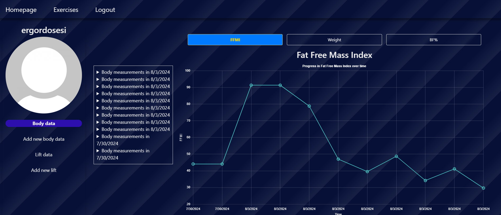

# Tumorido-fitTrack

## Description 

This project will be a full-stack application leveraging the MERN stack (MongoDB, Express.js, React, Node.js) to create a comprehensive fit tracking app. It aims to help users monitor their fitness activities, and track progress through an interactive and mobile-friendly interface. The application will utilize GraphQL for efficient data querying and mutations, with JWT for  authentication. The app will be deployed on Render.

## Instalation

N/A

## Usage

FitTrack enables users to efficiently monitor their fitness progress by allowing them to input and track body metrics, such as measurements, weight, and gender, to calculate body fat percentage and visualize this data over time. Users can also log and analyze their lifting activities—including lift weight, exercise name, sets, and reps—through detailed graphs. The app features a comprehensive exercise database for searching exercises by muscle group or name, and offers personalized calorie and macronutrient recommendations based on user inputs and activity levels.

## Screenshot displaying the deployed app

## URL to the deployed app

## Credits

N/A

## License

MIT License

Copyright (c) 2024 fabricioGuac

Permission is hereby granted, free of charge, to any person obtaining a copy
of this software and associated documentation files (the "Software"), to deal
in the Software without restriction, including without limitation the rights
to use, copy, modify, merge, publish, distribute, sublicense, and/or sell
copies of the Software, and to permit persons to whom the Software is
furnished to do so, subject to the following conditions:

The above copyright notice and this permission notice shall be included in all
copies or substantial portions of the Software.

THE SOFTWARE IS PROVIDED "AS IS", WITHOUT WARRANTY OF ANY KIND, EXPRESS OR
IMPLIED, INCLUDING BUT NOT LIMITED TO THE WARRANTIES OF MERCHANTABILITY,
FITNESS FOR A PARTICULAR PURPOSE AND NONINFRINGEMENT. IN NO EVENT SHALL THE
AUTHORS OR COPYRIGHT HOLDERS BE LIABLE FOR ANY CLAIM, DAMAGES OR OTHER
LIABILITY, WHETHER IN AN ACTION OF CONTRACT, TORT OR OTHERWISE, ARISING FROM,
OUT OF OR IN CONNECTION WITH THE SOFTWARE OR THE USE OR OTHER DEALINGS IN THE
SOFTWARE.

## Questions

If you have any questions or need help with the project, feel free to contact me through the following channels: - Connect with me on GitHub at [fabricioGuac](https://github.com/fabricioGuac)  - Drop me an email at [guacutofabricio@gmail.com](https://github.com/guacutofabricio@gmail.com)   Don't hesitate to reach out if you need any clarifications or want to share feedback. I'm here to assist you!